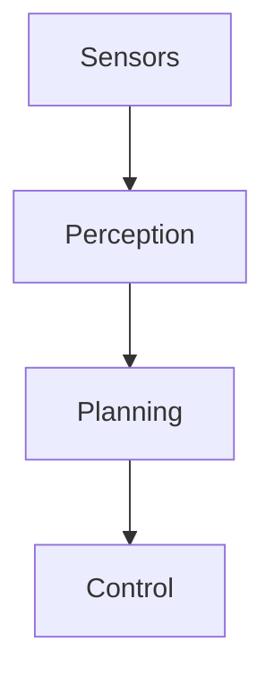

# Pandoc + reveal.js Presentation Conversion System

This system uses Pandoc and reveal.js to convert `docs/physical_ai_autonomous_driving.md` into an interactive HTML presentation.

## File Description

### Core Files
- `create_pandoc_presentation.sh` - Main conversion script (recommended)
- `preprocess_for_slides.py` - Markdown preprocessing script
- `pandoc_revealjs_config.yaml` - Pandoc configuration file
- `convert_to_revealjs.sh` - Simple conversion script
- `serve_pandoc_presentation.py` - Local server script

### Output Files
- `physical_ai_presentation.html` - Final reveal.js presentation
- `physical_ai_slides.md` - Preprocessed Markdown file

## System Requirements

### Required Software
[Mac install](https://pandoc.org/installing.html)
```bash
# macOS
brew install pandoc
brew install librsvg python homebrew/cask/basictex

# Ubuntu/Debian
sudo apt-get update
sudo apt-get install pandoc python3

# Windows
# Download and install Pandoc: https://pandoc.org/installing.html
# Install Python 3: https://www.python.org/downloads/
```

## Usage

### Method 1: One-Click Conversion (Recommended)
```bash
# Run complete conversion process
./create_pandoc_presentation.sh
```

This script will:
1. Check dependencies
2. Preprocess Markdown document
3. Convert to reveal.js using Pandoc
4. Create local server script
5. Provide detailed usage instructions

### Method 2: Step-by-Step Execution
```bash
# Step 1: Preprocess Markdown
python3 preprocess_for_slides.py

# Step 2: Convert using Pandoc
pandoc physical_ai_slides.md \
    --defaults=pandoc_revealjs_config.yaml \
    -t revealjs \
    -s \
    -o physical_ai_presentation.html

# Step 3: Start local server
python3 serve_pandoc_presentation.py
```

### Method 3: Simple Conversion
```bash
# Quick conversion with basic settings
./convert_to_revealjs.sh
```

## Viewing the Presentation

### Start Local Server
```bash
python3 serve_pandoc_presentation.py
```

The server will automatically:
- Try ports 8000, 8001, 8002, etc.
- Open the presentation in browser
- Display mobile device access address

### Direct File Opening
```bash
# macOS
open physical_ai_presentation.html

# Linux
xdg-open physical_ai_presentation.html

# Windows
start physical_ai_presentation.html
```

## Presentation Features

### Navigation Controls
- **Arrow Keys** - Navigate forward/backward slides
- **Space** - Next slide
- **Shift + Space** - Previous slide
- **Home/End** - First/last slide

### Special Features
- **F** - Fullscreen mode
- **S** - Speaker notes mode
- **O** - Overview mode (show all slides)
- **B** - Black screen mode
- **?** - Show help information
- **Esc** - Exit special modes

### Mobile Device Support
- Touch swipe navigation
- Responsive design
- Auto-scaling

## Custom Configuration

### Modify Theme
Edit `pandoc_revealjs_config.yaml`:
```yaml
theme: "black"  # Options: white, league, sky, beige, simple, serif, blood, night, moon, solarized
transition: "slide"  # Options: none, fade, slide, convex, concave, zoom
```

### Custom Styling
Modify CSS in the configuration file:
```yaml
css:
  - |
    .reveal h1 {
      color: #your-color;
    }
```

### Adjust Slide Division
Modify logic in `preprocess_for_slides.py`:
- `slide-level: 2` - Use H2 headings as new slides
- `slide-level: 1` - Use H1 headings as new slides

## Advanced Features

### Math Formula Support
Use MathJax to render mathematical formulas:
```markdown
$$E = mc^2$$

Inline formula: $\alpha + \beta = \gamma$
```

### Code Highlighting
Supports syntax highlighting for multiple programming languages:
```python
def autonomous_driving():
    return "Future is here!"
```

### Chart Support
Supports Mermaid charts:


### Fragment Display
Use fragment class for step-by-step display:
```markdown
- First point {.fragment}
- Second point {.fragment}
- Third point {.fragment}
```

## Troubleshooting

### Common Issues

1. **Pandoc Not Installed**
   ```bash
   # macOS
   brew install pandoc
   
   # Ubuntu
   sudo apt-get install pandoc
   ```

2. **Python Not Installed**
   ```bash
   # Check Python version
   python3 --version
   
   # Install Python 3
   # macOS: brew install python3
   # Ubuntu: sudo apt-get install python3
   ```

3. **Port Occupied**
   - Server script will automatically try multiple ports
   - Manually specify port: `python3 -m http.server 8080`

4. **Images Not Displaying**
   - Ensure image paths are correct
   - Use relative paths: `docs/figures/image.png`

5. **Math Formulas Not Displaying**
   - Ensure MathJax is enabled: `--mathjax`
   - Check network connection (MathJax loads from CDN)

### Debug Mode
```bash
# View detailed error information
pandoc physical_ai_slides.md -t revealjs -s -o test.html --verbose

# Check preprocessing results
cat physical_ai_slides.md | head -50
```

## Performance Optimization

### Large Document Processing
- Preprocessing script automatically splits long paragraphs
- Tables automatically get small font styling
- Images are automatically resized

### Loading Speed Optimization
- Use CDN version of reveal.js
- Compress image files
- Reduce unnecessary animation effects

## Deployment Options

### Local Viewing
```bash
python3 serve_pandoc_presentation.py
```

### Static Hosting
Upload `physical_ai_presentation.html` to:
- GitHub Pages
- Netlify
- Vercel
- Any static file hosting service

### Offline Usage
Download reveal.js locally:
```bash
# Download reveal.js
wget https://github.com/hakimel/reveal.js/archive/4.3.1.zip
unzip 4.3.1.zip

# Modify configuration to use local version
revealjs-url: "./reveal.js-4.3.1/"
```

## Extended Features

### Add Audio
```html
<audio controls>
  <source src="audio.mp3" type="audio/mpeg">
</audio>
```

### Add Video
```html
<video controls width="80%">
  <source src="video.mp4" type="video/mp4">
</video>
```

### Custom Backgrounds
```markdown
## Title {data-background-color="#ff0000"}

## Image Background {data-background-image="image.jpg"}
```

## Technical Details

### Conversion Process
1. **Preprocessing**: Optimize Markdown structure
2. **Conversion**: Pandoc generates HTML
3. **Enhancement**: Add custom styles and features
4. **Serving**: Local HTTP server

### File Structure
```
.
├── docs/
│   └── physical_ai_autonomous_driving.md  # Source document
├── create_pandoc_presentation.sh          # Main script
├── preprocess_for_slides.py              # Preprocessing
├── pandoc_revealjs_config.yaml           # Configuration
├── physical_ai_slides.md                 # Preprocessing result
├── physical_ai_presentation.html          # Final presentation
└── serve_pandoc_presentation.py           # Server
```

## Updates and Maintenance

### Update Source Document
1. Modify `docs/physical_ai_autonomous_driving.md`
2. Re-run `./create_pandoc_presentation.sh`
3. Refresh browser to view updates

### Version Control
Recommend adding these files to version control:
- All `.sh` and `.py` scripts
- `pandoc_revealjs_config.yaml`
- `PANDOC_REVEALJS_README.md`

Ignore generated files:
- `physical_ai_presentation.html`
- `physical_ai_slides.md`

## Support and Feedback

If you encounter issues or have improvement suggestions, please:
1. Check the troubleshooting section in this document
2. View Pandoc official documentation: https://pandoc.org/
3. View reveal.js official documentation: https://revealjs.com/

---

**Enjoy your Physical AI presentation!** 🚀